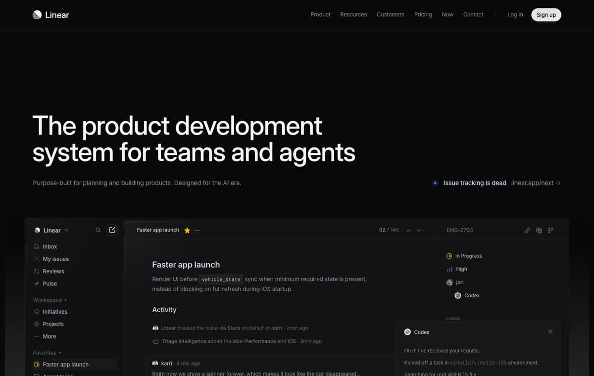
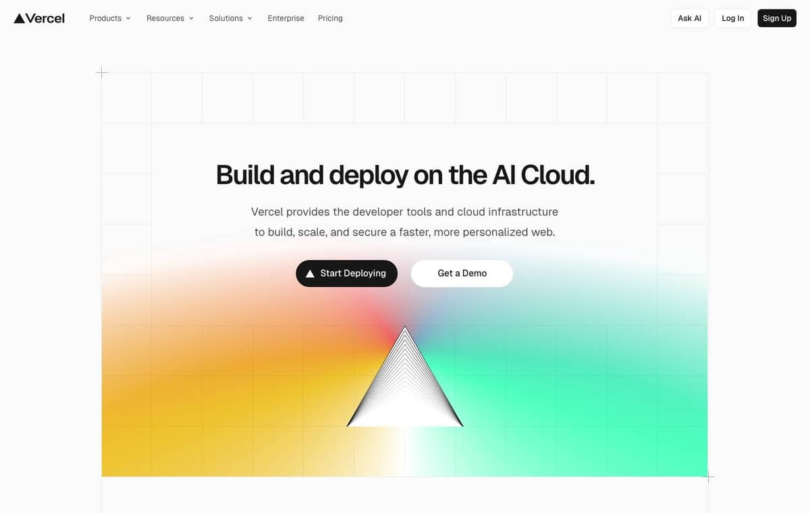
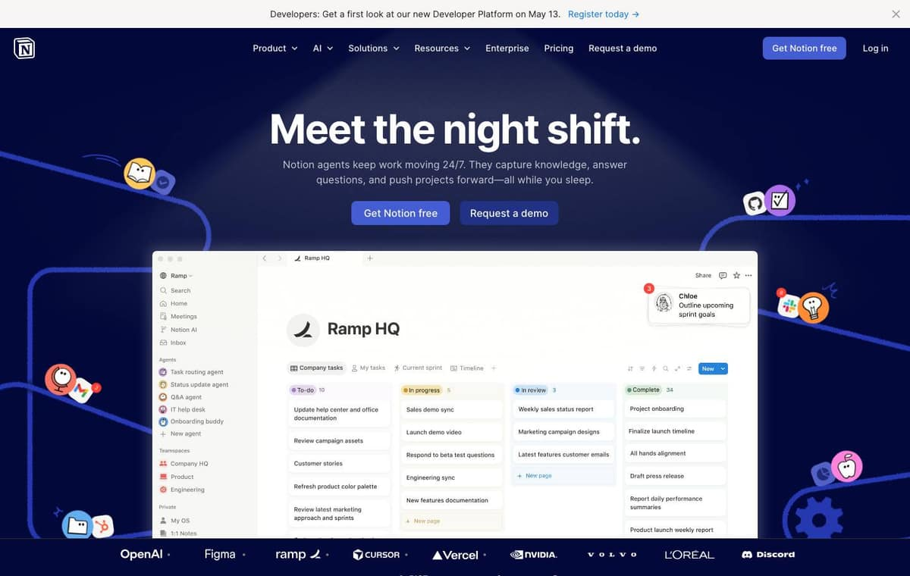
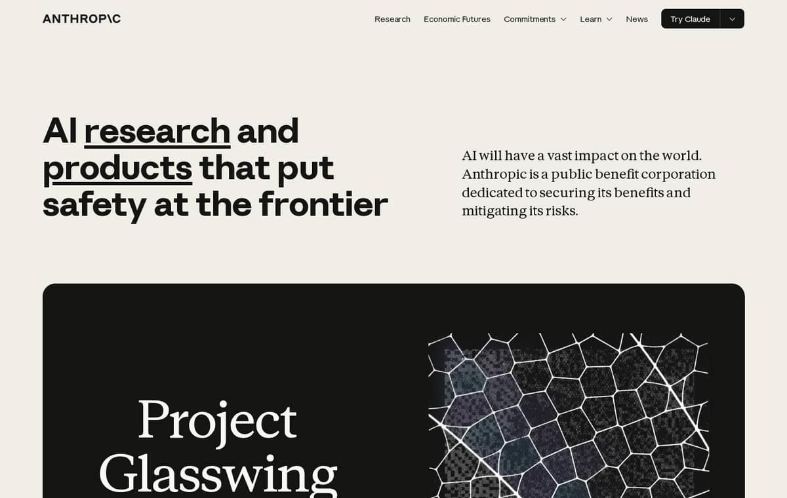
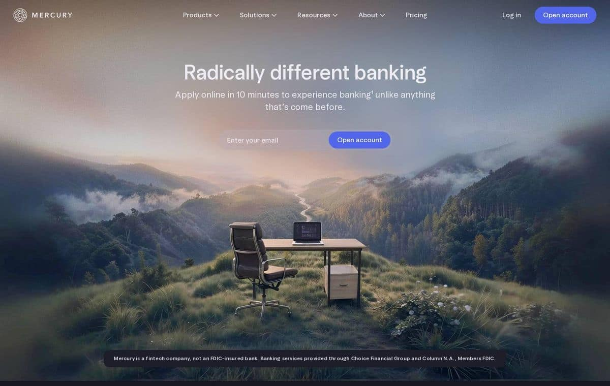
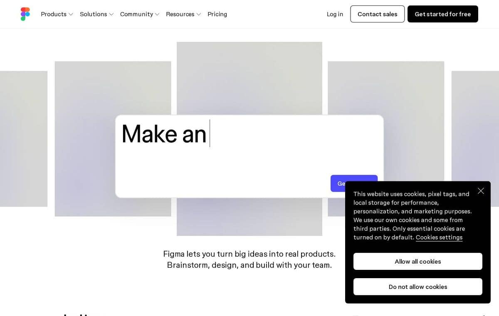
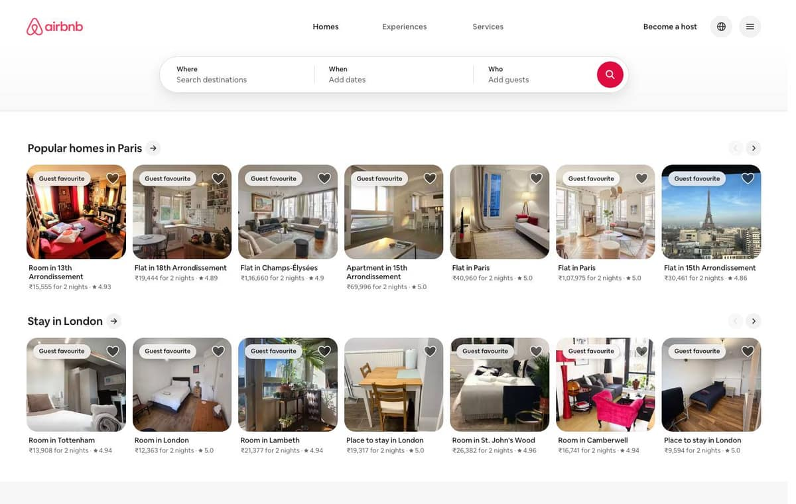

<div align="center">


# DesignMD

### Production-grade design context for AI coding workflows.

Extract a real design system from any production URL — colors, typography, spacing, breakpoints, motion, interaction states — and stream it as a portable `DESIGN.md` your coding agent can actually read.

[](https://www.npmjs.com/package/@designmdcc/cli)
[](https://designmd.cc)
[](https://designmd.cc/benchmarks)
[](./LICENSE)

[**Web**](https://designmd.cc) · [**Benchmarks**](https://designmd.cc/benchmarks) · [**CLI on npm**](https://www.npmjs.com/package/@designmdcc/cli) · [**Examples**](./examples) · [**Roadmap**](./docs/roadmap.md)

</div>

<br />

---

## Quick start

```bash
npx @designmdcc/cli stripe.com > DESIGN.md
```

That's the whole flow. No account, no config, no API key. The command streams a measured `DESIGN.md` spec for `stripe.com` to stdout; redirect it into a file and hand it to your AI coding agent.

For repeat use, install globally:

```bash
npm install -g @designmdcc/cli
dmd stripe.com > DESIGN.md
```

Requires **Node 18+**.

<br />

---

## What it does

```
URL  →  Live browser measurement  →  Structured tokens  →  DESIGN.md  →  Your AI agent
```

DesignMD opens the URL in a headless browser, measures the real visual system — colors from computed styles, typography from the cascade, breakpoints from live `@media` rules, hover/focus states from the CSSOM — and synthesizes a portable specification.

The output is the kind of file a senior engineer would actually use to rebuild the brand. Drop it into Cursor, Claude Code, Windsurf, Aider, Copilot, or paste it into any LLM chat. The model gets ground truth instead of guesses.

<br />

---

## Terminal usage

```bash
dmd <url>                  # stream DESIGN.md to stdout
dmd <url> --out=PATH       # write to a file
dmd <url> --json           # extract tokens only (no LLM call — instant, no quota)
dmd <url> --force          # bypass cache, re-extract from live page
dmd <url> --quiet          # suppress progress messages on stderr
dmd --help
dmd --version
```

### Common patterns

```bash
# Pipe into a project file
dmd stripe.com > ./design/stripe.md

# Send to clipboard
dmd https://linear.app | pbcopy

# Token-only extraction (machine-readable, free, instant)
dmd vercel.com --json | jq '.colors'

# Self-hosting / regional endpoint
DESIGNMD_API=https://my-designmd.internal dmd notion.so
```

`stdout` always carries the markdown (or JSON). Progress lines go to `stderr`, so pipes stay clean.

<br />

---

## AI workflow integration

The generated `DESIGN.md` is purpose-built for LLM context windows. Drop it in once; reference it from your agent's rules file.

### Claude Code

Add to your project's `CLAUDE.md`:

```markdown
When building any UI in this project, read @DESIGN.md before generating code.
Use the colors, typography, and spacing from that file exactly — do not invent
brand values.
```

### Cursor

Add to `.cursor/rules` (or `.cursorrules`):

```
Read DESIGN.md before writing UI code. Use its color palette, type scale,
and spacing values exactly. Every brand value should trace back to the file.
```

### Windsurf · Aider · Cline · Continue

Same pattern — every modern coding agent supports a project-root rules file. Reference `DESIGN.md` from it.

Full integration guide: [`docs/using-with-ai-tools.md`](./docs/using-with-ai-tools.md).

<br />

---

## Sample output

A snippet from [`examples/DESIGN-stripe.md`](./examples/DESIGN-stripe.md):

```markdown
## Color Palette & Roles

### Primary
- **Brand Indigo (#0a2540)** — Hero typography, primary footer surface
- **Stripe Purple (#635bff)** — Primary buttons, focus rings, link accents

### Surface
- **Pure White (#ffffff)** — Page background, card surface
- **Cool Mist (#f6f9fc)** — Secondary surface, alternating sections

### Typography
| Role    | Font      | Size | Weight | Line Height |
|---------|-----------|------|--------|-------------|
| Display | Sohne Var | 64px | 600    | 1.05        |
| H1      | Sohne Var | 40px | 600    | 1.15        |
| Body    | Sohne Var | 18px | 400    | 1.6         |
| Code    | Sohne Mono| 14px | 400    | 1.5         |

### Breakpoints (measured live)
- 480px · 600px · 768px · 880px · 1024px · 1200px · 1440px
```

Full file: [DESIGN-stripe.md](./examples/DESIGN-stripe.md) · [Live page](https://designmd.cc/benchmarks/stripe)

<br />

---

## More examples

Eight production sites, each measured live. Click a card for the full `DESIGN.md`.

<table width="100%">
<tr>
<td width="25%" align="center"><a href="./examples/DESIGN-stripe.md"></a><br /><sub><b>Stripe</b></sub></td>
<td width="25%" align="center"><a href="./examples/DESIGN-linear.md"></a><br /><sub><b>Linear</b></sub></td>
<td width="25%" align="center"><a href="./examples/DESIGN-vercel.md"></a><br /><sub><b>Vercel</b></sub></td>
<td width="25%" align="center"><a href="./examples/DESIGN-notion.md"></a><br /><sub><b>Notion</b></sub></td>
</tr>
<tr>
<td width="25%" align="center"><a href="./examples/DESIGN-anthropic.md"></a><br /><sub><b>Anthropic</b></sub></td>
<td width="25%" align="center"><a href="./examples/DESIGN-mercury.md"></a><br /><sub><b>Mercury</b></sub></td>
<td width="25%" align="center"><a href="./examples/DESIGN-figma.md"></a><br /><sub><b>Figma</b></sub></td>
<td width="25%" align="center"><a href="./examples/DESIGN-airbnb.md"></a><br /><sub><b>Airbnb</b></sub></td>
</tr>
</table>

A larger reference catalog — 56 measured sites across 13 categories — is live at [**designmd.cc/benchmarks**](https://designmd.cc/benchmarks).

<br />

---

## Why DESIGN.md

| Approach | Failure mode |
|---|---|
| Agent guesses from prompt | Hallucinates plausible-looking but wrong colors, fonts, spacing |
| Designer hand-documents tokens | Stale within weeks; doesn't scale |
| Screenshot → vision model | Loses structural information; treats decorative pixels as design intent |
| Static design-system catalog | Hand-curated, biased to designer aesthetics, doesn't match a real brand |

DesignMD measures live, then formalizes the measurement as a markdown spec that survives the round-trip into an LLM context window. The file is portable, diff-able, and re-generable when the source site evolves.

<br />

---

## Exit codes

The CLI uses distinct exit codes so scripts and agents can react correctly:

| Code | Meaning                                        |
| ---- | ---------------------------------------------- |
| `0`  | Success                                        |
| `1`  | User error (bad URL, unsupported flag, refused extraction) |
| `2`  | Transient — try again (rate limit, server busy, timeout)   |
| `3`  | Network error                                  |

<br />

---

## Rate limits

Anonymous use: **5 generations per day** per IP-bucket. The `--json` flag does not count against this — it skips the LLM step entirely and returns the raw token extraction.

Per-user API keys with higher quotas arrive when account auth ships. See the [roadmap](./docs/roadmap.md).

<br />

---

## Roadmap

See [`docs/roadmap.md`](./docs/roadmap.md) for the full plan.

- [x] 56-site benchmark catalog
- [x] AI-ready `DESIGN.md` exports (markdown + JSON + thumbnail)
- [x] **CLI client** — `@designmdcc/cli` shipped
- [ ] **MCP server** — `@designmdcc/mcp` for native Claude Desktop / Cursor / Windsurf tool calls — *next*
- [ ] 300-site catalog expansion
- [ ] Comparison pages — `/benchmarks/compare/<a>-vs-<b>`
- [ ] Structured search API — query benchmarks by palette / font / breakpoint
- [ ] Per-user accounts + higher quotas
- [ ] Token diff over time

<br />

---

## Proprietary boundary

This repository is the **public developer surface**. It contains:

- Sample `DESIGN.md` outputs from the live catalog (`examples/`)
- High-level architecture and product positioning (`docs/`)
- UI screenshots (`screenshots/`)
- The CLI's published documentation (this README)

It does **not** contain:

- The extraction pipeline or browser instrumentation
- LLM prompts and synthesis logic
- Server source, rate-limiting, caching, or auth internals
- Schema definitions or operator tooling

For commercial licensing or production-access inquiries, reach out — [adityaraj.info](https://adityaraj.info).

<br />

---

## Environment

| Variable        | Default                  | Purpose                                    |
| --------------- | ------------------------ | ------------------------------------------ |
| `DESIGNMD_API`  | `https://designmd.cc`    | Override the API base URL (self-hosting)   |

<br />

---

## Contributing

This is a curated developer surface, not a fully open-source project. We welcome:

- Bug reports on [designmd.cc](https://designmd.cc) — open an issue here
- Benchmark suggestions — open an issue with a URL you want measured
- Documentation improvements in `docs/`
- Better sample examples — PRs against `examples/` welcome

For larger changes, open an issue first to discuss. See [CONTRIBUTING.md](./CONTRIBUTING.md).

<br />

---

## License

[MIT](./LICENSE) — covers the materials in this repository: the CLI source, sample `DESIGN.md` outputs, documentation, screenshots, and example thumbnails.

The MIT license does **not** extend to:

- The DesignMD production source code, automation, or infrastructure
- The token-extraction pipeline and prompts
- The DesignMD name, logo, and brand identity

<br />

---

## Acknowledgments

Built by [Aditya Raj](https://adityaraj.info). Thanks to the designers and engineers behind the modern web whose publicly accessible visual systems make benchmarking and design research possible.

<br />

<div align="center">

**[Try the live demo →](https://designmd.cc)** · **[Install the CLI →](https://www.npmjs.com/package/@designmdcc/cli)**

</div>
