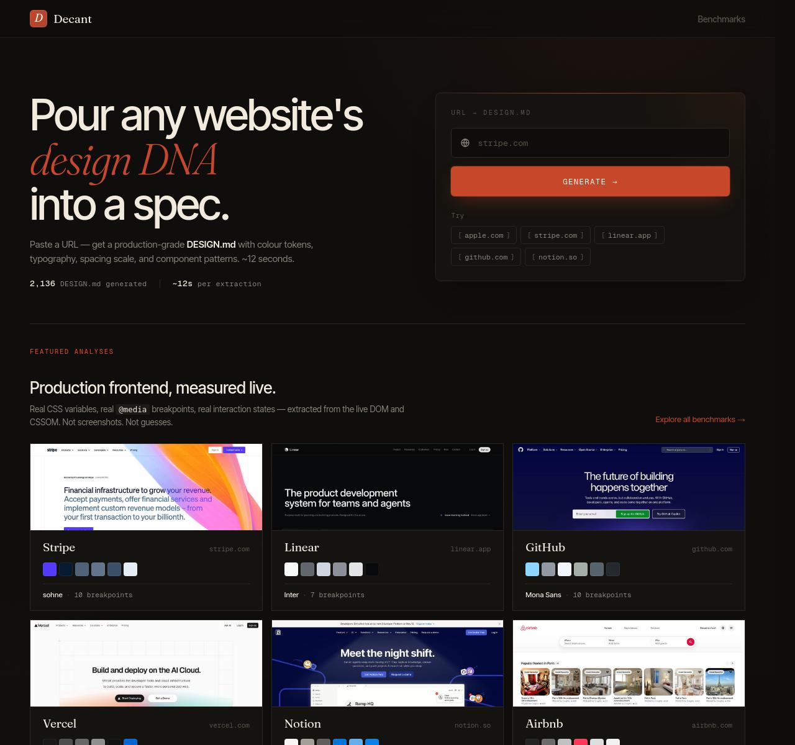
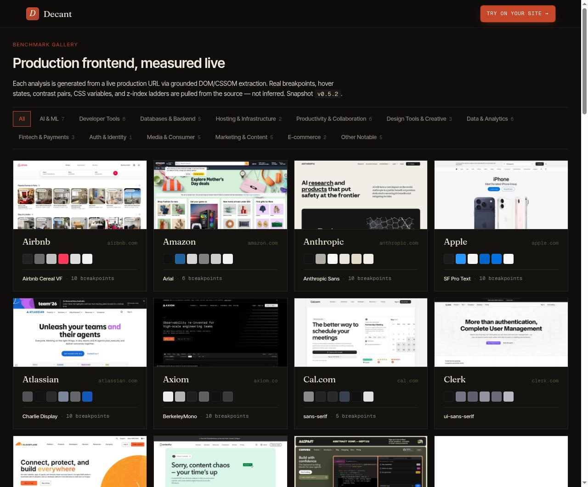

<div align="center">

# DesignMD

### Structured design intelligence for modern websites.

Turn any production URL into a measured, AI-ready design specification — colors, typography, spacing, breakpoints, and interaction states, captured directly from the live page.

[](https://designmd.adityaraj.info)
[](https://designmd.adityaraj.info/benchmarks)
[](https://designmd.adityaraj.info)
[](./LICENSE)

[**Live site**](https://designmd.adityaraj.info) · [**Benchmark catalog**](https://designmd.adityaraj.info/benchmarks) · [**Examples**](./examples) · [**Roadmap**](./docs/roadmap.md)

</div>

<br />



<br />

---

## Overview

DesignMD measures the real visual system of a production website and formalizes it as a portable `DESIGN.md` specification — every color, font, spacing value, and interaction state pulled from the live page itself, not inferred or guessed.

The result is an **AI-ready design context** that drops cleanly into Claude, Cursor, Copilot, or any coding agent, plus a **growing benchmark catalog** of the web's most well-designed production sites.

```
URL  →  Live measurement  →  Structured specification  →  AI-ready context
```

→ **[Try the live demo at designmd.adityaraj.info](https://designmd.adityaraj.info)**

<br />

---

## Preview

A measured gallery of curated reference sites — every signal sourced live from production.

<table width="100%">
<tr>
<td width="50%" align="center" valign="top">
  <a href="https://designmd.adityaraj.info"></a>
  <br /><sub><b>Homepage</b> · paste any URL, receive a <code>DESIGN.md</code> in ~12 seconds.</sub>
</td>
<td width="50%" align="center" valign="top">
  <a href="https://designmd.adityaraj.info/benchmarks"></a>
  <br /><sub><b>Benchmark catalog</b> · 56 measured sites across 13 curated categories.</sub>
</td>
</tr>
</table>

<br />

**Selected benchmark thumbnails** — each card links to a full `DESIGN.md` example.

<table width="100%">
<tr>
<td width="25%" align="center"><a href="./examples/DESIGN-stripe.md"></a><br /><sub><b>Stripe</b></sub></td>
<td width="25%" align="center"><a href="./examples/DESIGN-linear.md"></a><br /><sub><b>Linear</b></sub></td>
<td width="25%" align="center"><a href="./examples/DESIGN-vercel.md"></a><br /><sub><b>Vercel</b></sub></td>
<td width="25%" align="center"><a href="./examples/DESIGN-notion.md"></a><br /><sub><b>Notion</b></sub></td>
</tr>
<tr>
<td width="25%" align="center"><a href="./examples/DESIGN-anthropic.md"></a><br /><sub><b>Anthropic</b></sub></td>
<td width="25%" align="center"><a href="./examples/DESIGN-mercury.md"></a><br /><sub><b>Mercury</b></sub></td>
<td width="25%" align="center"><a href="./examples/DESIGN-figma.md"></a><br /><sub><b>Figma</b></sub></td>
<td width="25%" align="center"><a href="./examples/DESIGN-airbnb.md"></a><br /><sub><b>Airbnb</b></sub></td>
</tr>
</table>

<br />

---

## Key Features

| | |
|---|---|
| 🎨 **Color & design token analysis** | Full palette extraction with semantic roles — surface, foreground, accent, inverse — plus measured WCAG-compliant contrast pairs. |
| ✍️ **Typography system mapping** | Type families, weight ranges, size ramps, and line-height systems captured from the rendered page. |
| 📐 **Spacing & layout signals** | Measured spacing scale, breakpoint enumeration, z-index ladder, and stacking-context inventory. |
| ⚡ **Motion & interaction states** | Hover, focus, and active states surfaced live — including transition timing and easing curves. |
| 📚 **Curated benchmark catalog** | 56 reference sites across 13 categories — AI, developer tools, fintech, design, productivity, and more. |
| 🧠 **AI-ready DESIGN.md exports** | Portable specs drop straight into Claude, Cursor, Copilot, Windsurf, Aider, or plain LLM context windows. |

<br />

---

## How It Works

```
URL  →  Browser instrumentation  →  Signal capture  →  Specification synthesis  →  AI-ready export
```

DesignMD runs each analysis against a real production page inside a controlled measurement environment. At a high level:

1. **Live browser instrumentation** — every signal is captured against the fully rendered page, not inferred from static source or screenshots.
2. **Structured signal capture** — color, typography, spacing, layout primitives, interaction states, and breakpoints are extracted in their semantic context.
3. **Specification synthesis** — the structured measurements are formalized into a portable, human-readable `DESIGN.md` spec.
4. **AI-ready export** — the final document drops directly into Claude, Cursor, Copilot, or any LLM context window as ground-truth design grounding.

Each analysis is published at stable URLs with structured metadata:

- `/benchmarks/<slug>` — human-readable page (rendered spec + side panel)
- `/benchmarks/<slug>.json` — machine-readable structured extraction
- `/benchmarks/<slug>.jpg` — pre-cropped hero thumbnail
- `/sitemap.xml` — full crawlable index for ingestion pipelines

<br />

---

## Sample Output

A snippet from [`examples/DESIGN-stripe.md`](./examples/DESIGN-stripe.md):

```markdown
## Color Palette & Roles

### Primary
- **Brand Indigo (#0a2540)** — Hero typography, primary footer surface
- **Stripe Purple (#635bff)** — Primary buttons, focus rings, link accents

### Surface
- **Pure White (#ffffff)** — Page background, card surface
- **Cool Mist (#f6f9fc)** — Secondary surface, alternating sections

### Typography
| Role | Font | Size | Weight | Line Height |
|---|---|---|---|---|
| Display | Sohne Var | 64px | 600 | 1.05 |
| H1 | Sohne Var | 40px | 600 | 1.15 |
| Body | Sohne Var | 18px | 400 | 1.6 |
| Code | Sohne Mono | 14px | 400 | 1.5 |

### Breakpoints (measured live)
- 480px · 600px · 768px · 880px · 1024px · 1200px · 1440px
```

Full file: [DESIGN-stripe.md](./examples/DESIGN-stripe.md) · [Live page](https://designmd.adityaraj.info/benchmarks/stripe)

<br />

---

## Why This Exists

Every AI coding agent is good at writing code. None of them is good at matching a specific brand's visual system without ground-truth grounding.

| Approach | Failure mode |
|---|---|
| **AI guesses from text prompt** | Hallucinates plausible-looking but wrong colors, fonts, and spacing. |
| **Designer manually documents tokens** | Stale within weeks; doesn't scale across teams. |
| **Screenshot → vision model** | Loses structural information; treats decorative pixels as design intent. |
| **Existing design-system catalogs** | Hand-curated, static, biased to designer aesthetics. |

DesignMD measures every signal live, then formalizes it as an `MD` spec that survives the round-trip into an AI context window. The benchmark catalog turns every well-known production site into a reference implementation that compounds in value over time.

<br />

---

## Use Cases

- **AI-assisted UI development** — give Claude/Cursor a real design spec for any reference brand
- **Design system audits** — measure your own production site against industry leaders
- **Competitive analysis** — see exactly how Stripe, Linear, or Notion structure their visual systems
- **Onboarding new designers** — link to a measured spec instead of writing one from scratch
- **Research & teaching** — quantitative material for design education

<br />

---

## Roadmap

See [`docs/roadmap.md`](./docs/roadmap.md) for the full plan. Highlights:

- [x] Initial 56-site benchmark catalog
- [x] Curated category collections with editorial taglines
- [x] AI-ready `DESIGN.md` exports (markdown + JSON + thumbnail)
- [ ] 300-site catalog expansion — *in progress*
- [ ] Comparison pages — `/benchmarks/compare/notion-vs-linear`
- [ ] Structured search API — query benchmarks by palette / font / breakpoint
- [ ] Token diff over time — track how a site's design evolves
- [ ] CLI client — `designmd <url>` from the terminal
- [ ] Anonymous user accounts — saved history, higher quotas

<br />

---

## Proprietary Boundary

This is a **showcase repository**. It contains:

- ✅ Sample `DESIGN.md` outputs from the live catalog (`/examples`)
- ✅ High-level architecture and product positioning
- ✅ UI screenshots (`/screenshots`)
- ✅ Roadmap, FAQ, and contribution guidance (`/docs`)

It does **not** contain:

- ❌ The extraction pipeline
- ❌ Prompt engineering for the specification stage
- ❌ Browser automation internals
- ❌ Server source code
- ❌ Rate-limiting, caching, or auth internals
- ❌ Schema definitions or database code

For access to the production codebase or commercial licensing, please reach out — [adityaraj.info](https://adityaraj.info).

<br />

---

## Contributing

This is a curated showcase, not an open-source project. We welcome:

- 🪲 **Bug reports** on `designmd.adityaraj.info` (via GitHub Issues here)
- 💡 **Benchmark suggestions** — open an issue with a URL you want measured
- ✍️ **Documentation improvements** in `/docs`
- 🎨 **Better sample examples** — PRs against `/examples` welcome

For larger contributions, please open an issue first to discuss.

<br />

---

## License

[MIT](./LICENSE) — covers the **materials in this repository only**: `README`, sample `DESIGN.md` outputs, documentation, screenshots, and example thumbnails.

The MIT license **does not** extend to:

- The DesignMD production source code, automation, or infrastructure
- The token-extraction pipeline
- The LLM prompts and generation logic
- The DesignMD name, logo, and brand identity

For licensing the platform itself or commercial deployment, please reach out — [adityaraj.info](https://adityaraj.info).

<br />

---

## Acknowledgments

Built by [Aditya Raj](https://adityaraj.info). DesignMD is powered by automated browser instrumentation, frontend analysis pipelines, and AI-assisted specification generation.

Thanks to the designers and engineers behind the modern web whose publicly accessible systems make benchmarking and design research possible.

<br />

<div align="center">

**[Try the live demo →](https://designmd.adityaraj.info)**

</div>
